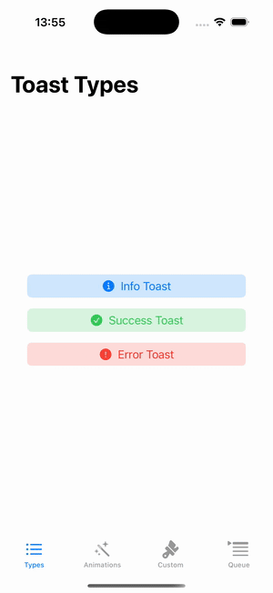
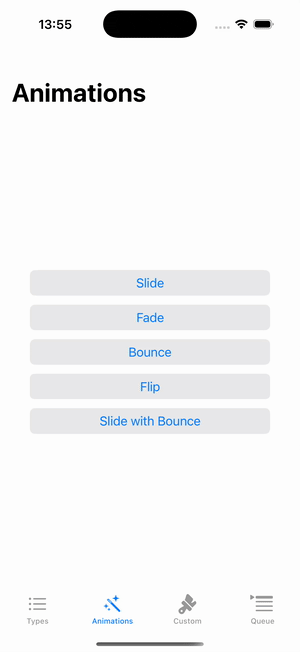
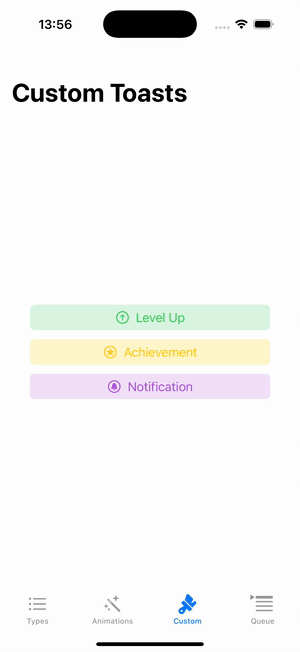
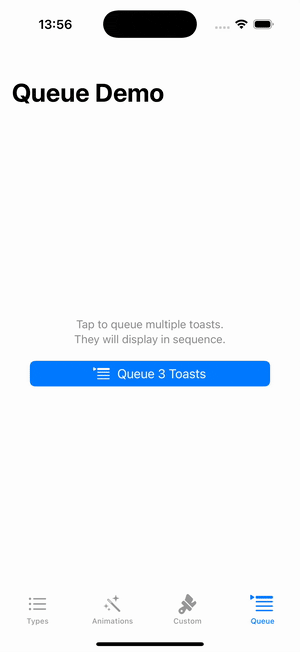

# SwiftUIToast

[](https://github.com/ivan-magda/swiftui-toast/actions/workflows/swift.yml)
[](https://swiftpackageindex.com/ivan-magda/swiftui-toast)
[](https://swiftpackageindex.com/ivan-magda/swiftui-toast)
[](LICENSE)

**Queue-managed toast notifications for modern SwiftUI.** Built on `@Observable` (iOS 17+). Toasts queue automatically - no more overlapping messages.

<p align="leading">
  
  
  
  
</p>

## Why SwiftUIToast?

| | SwiftUIToast | AlertToast |
|---|:---:|:---:|
| Architecture | `@Observable` | `@Published` (Combine) |
| Toast Queue | ✅ Built-in, automatic | ❌ Manual |
| Min iOS | 17.0 | 13.0 |
| Swift 6 | ✅ Full concurrency support | ⚠️ Partial |
| Strict Sendable | ✅ | ❌ |

**Choose SwiftUIToast if:** You're targeting iOS 17+ and want modern SwiftUI patterns without Combine boilerplate.

**Choose AlertToast if:** You need iOS 13–16 support.

## Features

- **3 toast types** — `.info`, `.success`, `.error` with semantic styling
- **Automatic queue** — Fire 5 toasts at once; they display sequentially (max 10 in queue, configurable)
- **6 animation presets** — `.slide`, `.fade`, `.scale`, `.bounce`, `.flip`, `.slideWithBounce`
- **Custom content** — Any SwiftUI view as toast content
- **Auto-dismiss** — Configurable duration (default 2s)
- **Tap-to-dismiss** — Optional, enabled by default
- **Top or bottom** — Position toasts where you need them
- **VoiceOver ready** — Proper accessibility labels and traits

## Requirements

- iOS 17.0+ / macOS 14.0+ / tvOS 17.0+
- Swift 6.0+
- Xcode 16.0+

## Installation

Add to your `Package.swift`:

```swift
dependencies: [
    .package(url: "https://github.com/ivan-magda/swiftui-toast.git", from: "1.0.0")
]
```

Or in Xcode: File → Add Package Dependencies → paste the URL.

## Quick Start

### 1. Add ToastManager to your app

```swift
import SwiftUI
import SwiftUIToast

@main
struct MyApp: App {
    @State private var toastManager = ToastManager()
    
    var body: some Scene {
        WindowGroup {
            ContentView()
                .environment(toastManager)
        }
    }
}
```

### 2. Show a toast

```swift
struct ContentView: View {
    @State private var showToast = false
    
    var body: some View {
        Button("Save") {
            showToast = true
        }
        .toast(isPresented: $showToast, message: "Saved!", type: .success)
    }
}
```

That's it. The toast auto-dismisses after 2 seconds.

## Usage

### Predefined Types

```swift
// Info (default blue)
.toast(isPresented: $show, message: "Syncing...", type: .info)

// Success (green checkmark)
.toast(isPresented: $show, message: "Done!", type: .success)

// Error (red X)
.toast(isPresented: $show, message: "Failed", type: .error)
```

### Custom Content

```swift
.toast(isPresented: $show, configuration: .top) {
    HStack(spacing: 8) {
        Image(systemName: "star.fill")
            .foregroundStyle(.yellow)
        Text("Added to favorites")
            .fontWeight(.medium)
    }
    .padding(.horizontal, 16)
    .padding(.vertical, 12)
    .background(.ultraThinMaterial, in: Capsule())
}
```

### Animation Presets

```swift
.toast(isPresented: $show, message: "Bounce!", configuration: .bouncy())
.toast(isPresented: $show, message: "Fade!", configuration: .fade())
.toast(isPresented: $show, message: "Flip!", configuration: .flip())
```

### Full Configuration

```swift
let config = ToastConfiguration(
    duration: 3.0,           // seconds (0 = no auto-dismiss)
    position: .top,          // .top or .bottom
    tapToDismiss: true,
    dismissDelay: 0.2,       // delay before dismiss animation
    animation: .bounce()
)

.toast(
    isPresented: $show,
    message: "Custom config",
    type: .success,
    configuration: config
)
```

### Queue Management

Multiple toasts queue automatically:

```swift
struct ContentView: View {
    @Environment(ToastManager.self) private var toastManager
    @State private var toast1 = false
    @State private var toast2 = false
    @State private var toast3 = false
    
    var body: some View {
        Button("Show 3 Toasts") {
            toast1 = true
            toast2 = true
            toast3 = true
        }
        .toast(isPresented: $toast1, message: "First", type: .info)
        .toast(isPresented: $toast2, message: "Second", type: .success)
        .toast(isPresented: $toast3, message: "Third", type: .error)
    }
}
```

Toasts display one at a time, in order. Queue holds up to 10 by default.

## Configuration Presets

| Preset | Position | Animation |
|--------|----------|-----------|
| `.standard` | bottom | slide |
| `.top` | top | slide |
| `.bottom` | bottom | slide |
| `.bouncy()` | bottom | bounce |
| `.fade()` | bottom | fade |
| `.flip()` | bottom | flip |

## Documentation

Full API documentation available at [Swift Package Index](https://swiftpackageindex.com/ivan-magda/swiftui-toast/documentation/swiftuitoast).

## Contributing

Issues and PRs welcome. Please:

1. Check existing issues first
2. Include reproduction steps for bugs
3. Run `swiftlint --strict` before submitting PRs

## License

MIT. See [LICENSE](LICENSE) for details.
