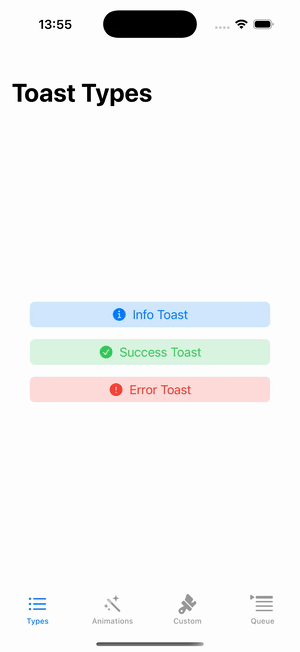
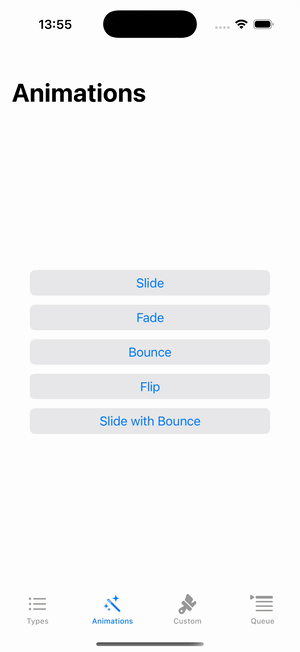
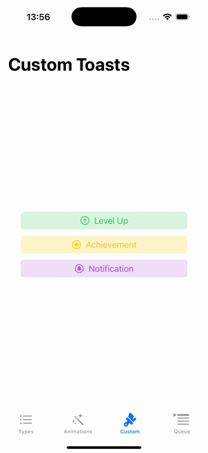
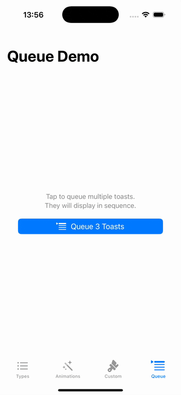

# SwiftUIToast

[](https://github.com/ivan-magda/swiftui-toast/actions/workflows/swift.yml)
[](https://swiftpackageindex.com/ivan-magda/swiftui-toast)
[](https://swiftpackageindex.com/ivan-magda/swiftui-toast)
[](LICENSE)

*Queue-managed toast notifications for SwiftUI, built on `@Observable` (iOS 17+).*

<p align="leading">
  
  
  
  
</p>

## Table of Contents

- [Background](#background)
- [Philosophy](#philosophy)
- [Features](#features)
- [Installation](#installation)
- [Usage](#usage)
- [Project Structure](#project-structure)
- [Contributing](#contributing)
- [License](#license)

## Background

Fire several toasts in quick succession and most SwiftUI implementations stack them on top of each other, leaving the user with a pile of overlapping messages. SwiftUIToast routes every toast through a single `ToastManager` that shows them one at a time in first-in, first-out order. Trigger five at once and they play back as a clean sequence.

The library targets iOS 17 and later, so it builds on `@Observable` and `@MainActor` rather than Combine. It compiles under Swift 6 strict concurrency.

## Philosophy

- **One manager, shared through the environment.** A single `ToastManager` owns the queue. You inject it once at the app root and call the `.toast()` modifier anywhere below.
- **Bindings drive presentation.** You toggle a `Bool` binding to show a toast; it flips back to `false` on dismiss. No imperative show/hide calls to keep in sync.
- **Presets first, full control when you need it.** Common cases are one-liners (`.success`, `.top`, `.bouncy()`). The full `ToastConfiguration` initializer is there when you want to set duration, position, and animation yourself.

## Features

- **Automatic queue** — toasts display sequentially, never overlapping. The queue holds 10 by default and is configurable.
- **Three semantic types** — `.info`, `.success`, and `.error`, each with its own SF Symbol and color.
- **Custom content** — pass any SwiftUI view as the toast body via a `@ViewBuilder` modifier.
- **Six animation presets** — `slide`, `fade`, `scale`, `bounce`, `flip`, and `slideWithBounce`, or build your own from any `Animation` and `AnyTransition`.
- **Auto-dismiss** — configurable duration, 3 seconds by default.
- **Tap-to-dismiss** — on by default, with a short configurable delay before the exit animation.
- **Top or bottom placement** — position toasts where they fit your layout.
- **VoiceOver support** — toasts carry accessibility labels and traits.

### Requirements

- iOS 17.0+ / macOS 14.0+ / tvOS 17.0+
- Swift 6.0+
- Xcode 16.0+

## Installation

### Xcode

Open **File → Add Package Dependencies**, paste the repository URL, and add the `SwiftUIToast` library to your target:

```
https://github.com/ivan-magda/swiftui-toast.git
```

### Package.swift

Add the package to your `dependencies` and list `SwiftUIToast` as a target dependency:

```swift
dependencies: [
    .package(url: "https://github.com/ivan-magda/swiftui-toast.git", from: "1.2.0")
],
targets: [
    .target(
        name: "YourTarget",
        dependencies: [
            .product(name: "SwiftUIToast", package: "swiftui-toast")
        ]
    )
]
```

## Usage

### Set up the manager

Create one `ToastManager` at the app root and inject it into the environment:

```swift
import SwiftUI
import SwiftUIToast

@main
struct MyApp: App {
    @State private var toastManager = ToastManager()

    var body: some Scene {
        WindowGroup {
            ContentView()
                .environment(toastManager)
        }
    }
}
```

### Show a toast

Bind the modifier to a `Bool` and set it to `true`. The toast appears and resets the binding when it dismisses:

```swift
struct ContentView: View {
    @State private var showToast = false

    var body: some View {
        Button("Save") {
            showToast = true
        }
        .toast(isPresented: $showToast, message: "Saved!", type: .success)
    }
}
```

### Semantic types

```swift
.toast(isPresented: $show, message: "Syncing…", type: .info)     // accent-colored info icon
.toast(isPresented: $show, message: "Done!", type: .success)     // green checkmark
.toast(isPresented: $show, message: "Upload failed", type: .error) // red exclamation
```

### Custom content

Use the `@ViewBuilder` variant when you need full control over the toast body. Supply your own background and padding:

```swift
.toast(isPresented: $show, configuration: .bouncy(position: .top)) {
    HStack(spacing: 8) {
        Image(systemName: "star.fill")
            .foregroundStyle(.yellow)
        Text("Added to favorites")
            .fontWeight(.medium)
    }
    .padding(.horizontal, 16)
    .padding(.vertical, 12)
    .background(.ultraThinMaterial, in: Capsule())
}
```

### Animation presets

```swift
.toast(isPresented: $show, message: "Bounce!", configuration: .bouncy())
.toast(isPresented: $show, message: "Fade!", configuration: .fade())
.toast(isPresented: $show, message: "Flip!", configuration: .flip())
```

Each preset also takes an optional `position`, for example `.fade(position: .top)`.

### Full configuration

`ToastConfiguration` exposes every knob. Set `duration: 0` to disable auto-dismiss:

```swift
let config = ToastConfiguration(
    duration: 4.0,
    position: .top,
    tapToDismiss: true,
    dismissDelay: 0.2,
    animation: .slideWithBounce(edge: .top)
)

.toast(
    isPresented: $show,
    message: "Custom config",
    type: .success,
    configuration: config
)
```

To swap only the animation and keep the other defaults, use `.with(animation:)`:

```swift
.toast(isPresented: $show, message: "Hello", configuration: .with(animation: .scale()))
```

### Queue management

Multiple toasts queue on their own. Trigger them together and they play in order:

```swift
struct ContentView: View {
    @State private var toast1 = false
    @State private var toast2 = false
    @State private var toast3 = false

    var body: some View {
        Button("Show 3 Toasts") {
            toast1 = true
            toast2 = true
            toast3 = true
        }
        .toast(isPresented: $toast1, message: "First", type: .info)
        .toast(isPresented: $toast2, message: "Second", type: .success)
        .toast(isPresented: $toast3, message: "Third", type: .error)
    }
}
```

Raise the limit for high-frequency scenarios by passing `maxQueueSize` when you create the manager:

```swift
@State private var toastManager = ToastManager(maxQueueSize: 25)
```

### Configuration presets

| Preset | Position | Animation |
|--------|----------|-----------|
| `.standard` | bottom | slide |
| `.top` | top | slide |
| `.bottom` | bottom | slide |
| `.bouncy()` | bottom | bounce |
| `.fade()` | bottom | fade |
| `.flip()` | bottom | flip |

Full API documentation lives on the [Swift Package Index](https://swiftpackageindex.com/ivan-magda/swiftui-toast/documentation/swiftuitoast).

## Project Structure

```
Sources/SwiftUIToast/
├── ToastManager.swift          # @Observable queue, displays toasts one at a time
├── ToastConfiguration.swift    # Duration, position, animation, and presets
├── ToastAnimation.swift        # Six animation presets plus custom factory
├── ToastType.swift             # .info / .success / .error styling
├── ToastPosition.swift         # Top or bottom placement
├── ToastView.swift             # Default styled toast view
├── ToastModifier.swift         # Visibility, timing, and dismiss handling
├── LayoutInsets.swift          # Safe-area padding
├── Extensions/
│   └── View+Toast.swift        # The .toast(…) modifiers
├── Helpers/
│   └── FlipEffect.swift        # 3D rotation used by .flip
└── Examples/
    └── ToastExamples.swift     # SwiftUI previews
```

## Contributing

Issues and pull requests are welcome.

1. Search existing issues before opening a new one.
2. Include reproduction steps for bug reports.
3. Run `swiftlint --strict` and `swift test` before submitting a pull request.

## License

Released under the MIT License. See [LICENSE](LICENSE) for the full text.
